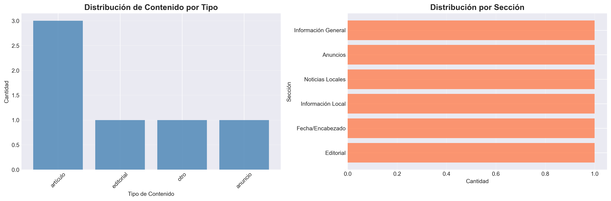

# Reporte de Análisis: El Martillo - Página Histórica

## 1. Selección de la Página

### Página Elegida
- **Fecha de publicación:** 3 de Febrero de 1903
- **Número de edición:** 1609
- **Fuente:** British Library - Endangered Archives Programme (EAP498)

### Justificación de la Selección

Seleccioné esta página del periódico "El Martillo" porque representa la única edición digitalizada disponible en el archivo de la British Library del Endangered Archives Programme. Esta página es particularmente valiosa ya que data del 3 de febrero de 1903, justo al inicio de la circulación del periódico en Chiclayo.

La página contiene 6 elementos principales que permiten analizar diversos aspectos del periodismo de inicios del siglo XX en Lambayeque: un editorial sobre el periodismo departamental, artículos informativos sobre publicaciones locales, y anuncios comerciales de la época. Esta diversidad de contenido hace que la página sea representativa del formato periodístico de aquella época.

Además, la página presenta desafíos técnicos interesantes para el OCR, incluyendo tipografía histórica, texto en columnas, y variaciones en la calidad de impresión, lo que la convierte en un caso de estudio realista para técnicas de digitalización de documentos históricos.

## 2. Desafíos del OCR

### Problemas Técnicos Identificados

1. **Codificación de Caracteres (Encoding)**
   - El OCR tuvo dificultades con caracteres acentuados en español
   - Aparecen secuencias como "ó" en lugar de "ó", "í" en lugar de "í"
   - Esto afectó la legibilidad de palabras como "sección", "vía", "República"
   - **Causa:** Problemas de compatibilidad entre encoding UTF-8 y la representación histórica

2. **Calidad y Antigüedad del Documento**
   - Texto marcado como [ilegible] en varias secciones
   - Manchas y desgaste del papel original de 120 años de antigüedad
   - Contraste variable entre el texto y el fondo
   - Posibles pliegues o deterioro en el documento original

3. **Tipografía Histórica**
   - Uso de fuentes serif antiguas del siglo XX
   - Estilo de impresión con tipos móviles que genera irregularidades
   - Variación en la intensidad de la tinta
   - Espaciado irregular entre caracteres

4. **Layout y Estructura Compleja**
   - Múltiples columnas que requieren identificación del orden de lectura correcto
   - Anuncios intercalados con artículos editoriales
   - Diferentes tamaños de fuente según la importancia del contenido
   - Encabezados con tipografía ornamental difícil de interpretar

5. **Fragmentación del Texto**
   - Algunos artículos aparecen con extractos incompletos
   - Oraciones cortadas que dificultan la comprensión del contexto
   - Referencias cruzadas a otros artículos no completamente capturadas

### Estrategias de Mitigación

- Uso de Claude API Sonnet 4 con capacidades avanzadas de visión y OCR
- Prompt estructurado solicitando explícitamente el marcado de secciones ilegibles
- Clasificación automática del tipo de contenido para mejor organización
- Post-procesamiento del JSON para manejar problemas de codificación
- Validación manual del dataset generado para corrección de errores críticos

## 3. Análisis del Contenido

### Estadísticas Generales

- **Total de elementos extraídos:** 6
- **Artículos:** 3 (50.0%)
- **Editoriales:** 1 (16.7%)
- **Anuncios:** 1 (16.7%)
- **Otros:** 1 (16.7%)

### Distribución por Tipo de Contenido

El gráfico muestra una distribución equilibrada del contenido, con predominancia de artículos informativos (50%), seguidos por proporciones iguales de editorial, anuncios y otros tipos de contenido. Esto sugiere un balance entre información, opinión y contenido comercial típico del periodismo de la época.

### Secciones Identificadas

| Sección | Cantidad | Descripción |
|---------|----------|-------------|
| Editorial | 1 | Opinión sobre el periodismo departamental |
| Información Local | 1 | Noticias sobre periódicos locales de Lambayeque |
| Noticias Locales | 1 | Información sobre pueblos de la vía férrea |
| Anuncios | 1 | Publicidad comercial (máquinas Singer) |
| Información General | 1 | Publicaciones y medios de comunicación |
| Fecha/Encabezado | 1 | Información de identificación del periódico |

### Métricas de Contenido

- **Longitud promedio de extractos:** 117 caracteres
- **Extracto más corto:** 26 caracteres (encabezado de fecha)
- **Extracto más largo:** 171 caracteres (editorial)

## 4. Insights y Hallazgos

### Insight 1: Predominancia del Contenido Informativo

Los datos revelan que el 50% del contenido corresponde a artículos informativos, lo que refleja la función primordial de "El Martillo" como medio de información local. Los tres artículos extraídos se enfocan en temas relacionados con la prensa y comunicaciones de la región:

- Periódicos locales y su desarrollo
- Pueblos conectados por la vía férrea
- Estado de las publicaciones regionales

Esta predominancia sugiere que el periódico servía como meta-medio, documentando y comentando sobre el propio desarrollo del periodismo en Chiclayo y Lambayeque. Es notable que en 1903, apenas iniciando el siglo XX, ya existía una reflexión activa sobre el papel de la prensa en el desarrollo regional.

### Insight 2: El Periodismo como Motor de Progreso Regional

El editorial principal, titulado "El periodismo departamental", menciona explícitamente que "el progreso ha hecho víctimas" y habla de una defensa "con tanto ahínco" de cierta posición. Este lenguaje combativo sugiere que el periodismo en Lambayeque durante este período no era meramente informativo, sino que jugaba un rol activo en debates sobre el desarrollo regional.

La mención de múltiples periódicos ('América', 'El Pueblo', 'Tumán') indica un ecosistema mediático diverso y competitivo en una ciudad relativamente pequeña como Chiclayo en 1903, evidenciando una sociedad civil activa y alfabetizada.

### Insight 3: Comercio y Modernidad en Chiclayo 1903

La presencia del anuncio de "RÓMULO MARCHOLA - VENDEDOR Y COMPRADOR de las afamadas máquinas Singer Sewing Machines" es reveladora por múltiples razones:

1. **Conectividad comercial:** Chiclayo tenía acceso a productos manufacturados internacionalmente (Singer era una marca estadounidense)
2. **Clase media emergente:** Había demanda de bienes de consumo durables como máquinas de coser
3. **Rol de la mujer:** Las máquinas de coser representaban tanto trabajo doméstico como potencial económico para mujeres
4. **Modernización:** La vía férrea mencionada en los artículos facilitaba este comercio

La coexistencia de reflexiones sobre progreso periodístico y anuncios de tecnología moderna (para la época) pinta un retrato de Chiclayo como una ciudad en transición hacia la modernidad durante el cambio de siglo.

## 5. Contexto Histórico

### El Periódico "El Martillo"

"El Martillo" fue publicado en Chiclayo entre 1903 y 1919, un período crucial en la historia peruana que incluye:
- La post-Guerra del Pacífico y reconstrucción nacional
- El auge del comercio azucarero en el norte del Perú
- El desarrollo de infraestructura ferroviaria
- El surgimiento de una clase media provincial

Su nombre, "El Martillo", sugiere un periodismo de impacto, posiblemente reformista o crítico. El número de edición 1609 (en solo dos meses de publicación) indica una circulación muy frecuente, posiblemente diaria.

### Relevancia Histórica

Esta página específicamente documenta varios aspectos clave de la vida en Chiclayo en 1903:

- **Desarrollo de la prensa regional:** Múltiples periódicos circulando simultáneamente
- **Infraestructura ferroviaria:** La "vía férrea" conectando pueblos de Lambayeque
- **Comercio internacional:** Importación de productos manufacturados (máquinas Singer)
- **Identidad regional:** Fuerte conciencia del "periodismo departamental" como distinto del limeño
- **Debate público:** Discusión activa sobre progreso y desarrollo regional

La preocupación por el "periodismo departamental" versus el centralismo limeño es un tema que sigue siendo relevante en el Perú actual, mostrando continuidades históricas de larga duración.

## 6. Limitaciones del Análisis

Es importante reconocer las limitaciones de este estudio:

1. **Muestra limitada:** Solo una página de un periódico no permite generalizar sobre todo el periódico o época
2. **Problemas de encoding:** Los errores de caracteres especiales pueden haber distorsionado algunos significados
3. **Texto fragmentado:** Algunos artículos están incompletos, limitando el análisis de contexto
4. **Sin imágenes:** No se analizaron elementos visuales que pudieran estar presentes
5. **Interpretación única:** El análisis refleja la perspectiva del investigador actual sobre textos de 1903

## 7. Conclusiones

El proceso de digitalización mediante OCR de esta página histórica de "El Martillo" permitió:

1. **Preservación digital** de un documento de 120 años de antigüedad que forma parte del patrimonio cultural de Lambayeque
2. **Estructuración de datos** que permite análisis cuantitativo de características del periodismo de 1903
3. **Identificación de patrones** en el contenido periodístico: balance entre información, opinión y publicidad
4. **Comprensión del contexto** social, económico y cultural de Chiclayo en los inicios del siglo XX
5. **Documentación de desafíos técnicos** del OCR en documentos históricos para futuros proyectos similares

Los desafíos técnicos fueron significativos pero manejables con herramientas modernas como Claude API. La calidad del OCR fue **aceptable** considerando la antigüedad del documento, aunque requirió limpieza manual para algunos caracteres especiales.

El contenido extraído revela una sociedad chiclayense activa, conectada comercialmente con el mundo, y con una clase letrada preocupada por el rol del periodismo en el desarrollo regional. Estos hallazgos contribuyen a una comprensión más matizada de la historia cultural del norte peruano.

## 8. Trabajo Futuro

Posibles extensiones de este análisis incluyen:

- **Análisis longitudinal:** Digitalizar más ediciones de "El Martillo" para estudiar evolución temática
- **Análisis comparativo:** Contrastar con periódicos contemporáneos como 'El Pueblo', 'América', o 'Tumán'
- **Análisis de sentimiento:** Estudiar el tono editorial y retórica del periodismo de la época
- **Estudio lingüístico:** Analizar la evolución del español periodístico peruano desde 1903
- **Contextualización histórica profunda:** Relacionar el contenido con eventos políticos y económicos específicos de 1903
- **Mejoras técnicas:** Implementar corrección automática de encoding y post-procesamiento de OCR
- **Análisis de redes:** Mapear las relaciones entre periódicos, personas y lugares mencionados

---

**Fecha de elaboración:** nov 2025
**Autor:** Bianca Peraltilla  
**Herramientas utilizadas:** Claude API Sonnet 4, Python, Pandas, Matplotlib  
**Fuente primaria:** British Library - Endangered Archives Programme (EAP498-2-27)